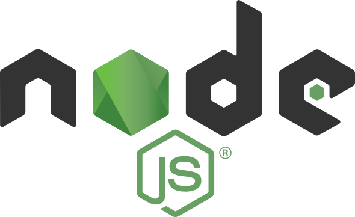

    

<h1 align="center">
  
</h1>
   
###    About Me:

👋 Hi there! I'm Ricardo Graner, a passionate web developer and data enthusiast based in London. My journey in the tech world started with a solid foundation in Excel and evolved into full-stack development. I love creating dynamic and scalable applications and exploring new technologies.

🚀 My skills include HTML, CSS, JavaScript, Node.js, React, PHP, Python, Django, and more. I've honed my craft through personal projects and academic pursuits, with a Master's degree in Data Science.

🌐 Currently, I'm exploring the intersection of web development and data science, aiming to build user-centric solutions and harness the power of data for impactful applications.

🔗 Let's connect! Check out my projects below 👇. Some repositories are private, so feel free to reach out for more details or discussions. Happy coding!

<h2 align="center">💹 Some of my Repos 💹</h2>

🔧[Sponsify](https://github.com/rgraner/sponsify/)
 
🔧[Metamaxie](https://github.com/rgraner/metamaxie/)
 
🔧[Restaurant Menu](https://github.com/rgraner/restaurant-menu/)

<!-- 

  
   
     

 -->

<h2 align="center">🔥 Languages & Frameworks & Tools & Abilities 🔥</h2> 

  
  
  
  
  
  
  
  
  
  
  
  
  
  
  
  
  
  
  

